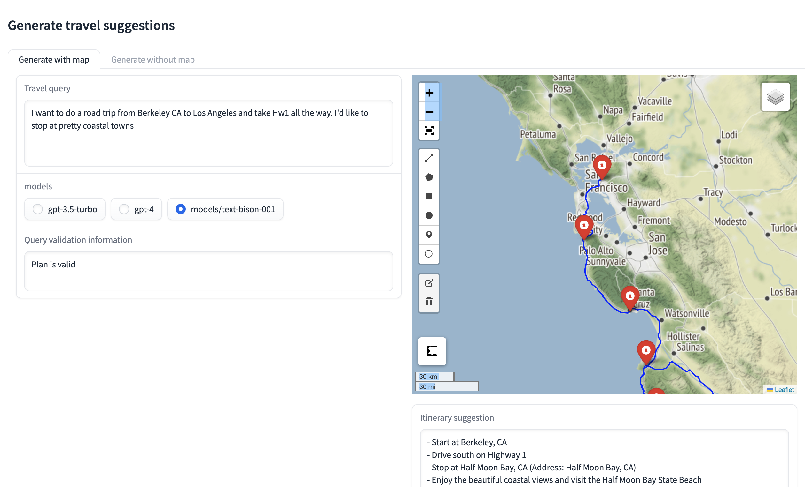
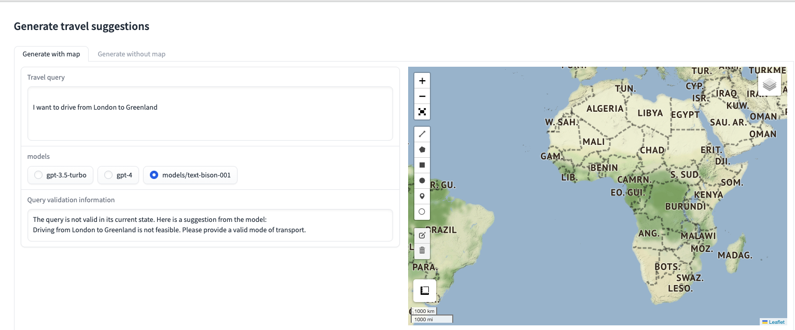
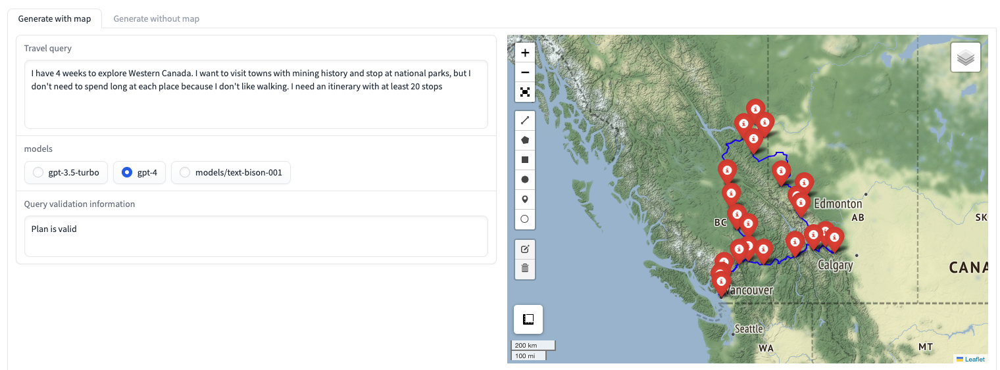

=============
TravelMapper
=============


.. image:: https://img.shields.io/pypi/v/travel_mapper.svg
        :target: https://pypi.python.org/pypi/travel_mapper

.. image:: https://img.shields.io/travis/rmartinshort/travel_mapper.svg
        :target: https://travis-ci.com/rmartinshort/travel_mapper

.. image:: https://readthedocs.org/projects/travel-mapper/badge/?version=latest
        :target: https://travel-mapper.readthedocs.io/en/latest/?version=latest
        :alt: Documentation Status


Basic usage
------------

TEST TEST

A travel agent that uses calls to OpenAI and Google Palm to build an itinerary and then Google Maps API to gather directions.

Create a ```.env``` file in the top level directory (i.e. travel_mapper) that contains the following lines

.. code-block:: bash

   OPENAI_API_KEY = {your open ai key}
   GOOGLE_MAPS_API_KEY = {your google maps api key}
   GOOGLE_PALM_API_KEY = {your google palm api key}

To test it out in a python console, try the following

.. code-block:: python

   from travel_mapper.test_without_gradio import test
   test()

This will use a default query and is useful to check if everything is installed correctly. You can also run
`test()` with a custom query, as in

.. code-block:: python

   test(query="A 2 day trip around Los Angeles that includes \
   the best views of the Hollywood sign")`

To run the gradio app, which allows more interactions with the models, run the following from a terminal

..  code-block:: bash

   python travel_mapper/user_interface/driver.py

You can also use the run script, which sets the pythonpath correctly if it's
run from the top level directory. You may need to give it permissions first

.. code-block:: bash

    travel_mapper/user_interface/run.sh


You should then be able to open the app locally

* Free software: MIT license
* Documentation: https://travel-mapper.readthedocs.io.

Please report errors or issues to martinshortr@gmail.com


Features
--------

1. Type your travel request, choose the model to use and it will generate a detailed itinerary and a map showing the suggested route



.. line-block:: ------------------

2. Basic error handling: If you enter an unrealistic request, it will explain why the request is unreasonable and may suggest an alterative



.. line-block:: ------------------

3. Generate a trip with more stops than the google maps API query limit for waypoints (which is 25 as of the time pf writing)
It does this by breaking the route in the segments and sending multiple requests



.. line-block:: ------------------

Credits
-------

This package was created with Cookiecutter_ and the `audreyr/cookiecutter-pypackage`_ project template.

.. _Cookiecutter: https://github.com/audreyr/cookiecutter
.. _`audreyr/cookiecutter-pypackage`: https://github.com/audreyr/cookiecutter-pypackage
